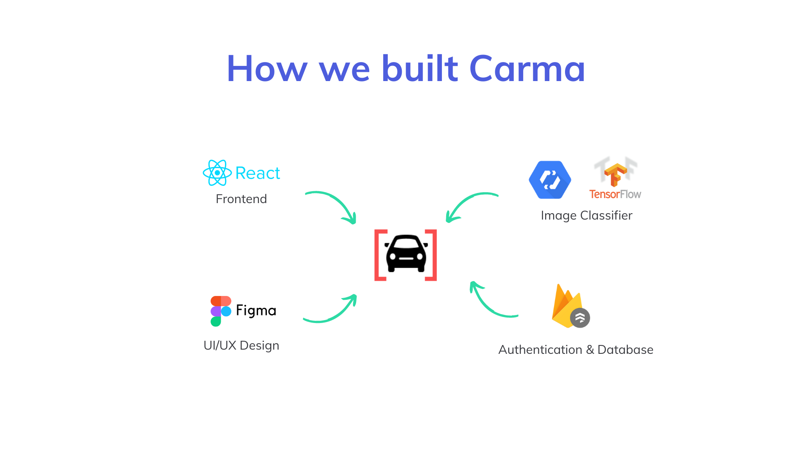

## Inspiration
With over 1.25 million road traffic deaths occurring each year and drunk driving accounting for about 40% of that, impaired driving is a very prevalent issue today that endangers not only the driver but innocent bystanders as well. With Ontario reopening from the COVID lockdown, there is a high chance that these statistics may only get worse due to studies in countries like the US and France showing fatality rates increasing by as much as 30% due to increased recklessness and changed habits involving substance use.

## What it does
Through machine learning and data analysis, Carma is able to quickly and accurately determine if a driver will be safe on the road helping to create greater transparency and less risk for Intact, their auto insurance provider. By also introducing a gamification component Carma makes driving safe, rewarding and fun!

When Carma is active, drivers can complete a quick sobriety test in seconds on the app to help confirm that they are in a safe and sober condition to drive. If users do not complete the test prior to driving, the app will prompt them to complete a test after their trip

The test consists of two parts, the first part is a short test that judges your reaction speed based on how fast you tap the dots that appear on the screen and the second part prompts the driver to take a selfie to look for visual indicators of sobriety

Earning Carma points by successfully passing sobriety tests allow Intact to collect data on your driving behaviour and subsequently provide you with up to a 20% discount on your auto-insurance premium when it comes time to renew your policy.

Watch a demo on [Devpost](https://devpost.com/software/carma-lown32).

## How we built it

GCP AutoML and TensorFlowJS were used for the image classifier model that looked for visual indicators of sobriety. ReactJS was used to create all user interface components, bringing Carma to life. Firebase and Firestore were used to connect with React and save user data. Finally, Figma was used to design the wireframes of the app and overall user flow

## Challenges we ran into
Non-technical: Our team was unfamiliar with insurance, but we overcame that by reaching out to Intact employees and sponsors at the hackathon to gain more insight on opportunities to solve problems in the insurance industry.
Technical: It was difficult to find images of intoxicated vs sober people, and it was very time consuming to train a neural network on this data using and deploy it to run purely on the client-side (ie. Reactjs web app). This was especially time consuming and difficult because our team has never used GCP AutoML or Tensorflow.js before.

## Accomplishments that we're proud of
We are proud of how complete and polished our project given our tight time constraints of a weekend. Features that we implemented include: user authentication, image classification, saving user scores, and users earning badges as milestones towards completion.

## What we learned
We learned that communication as a team was vital for ensuring that we completed all of our planned features on time.

## What's next for Carma
Moving forward, our team hopes to add a short multiple choice quiz section and an audio recording section that detects intoxication via the user’s voice to the sobriety test to more accurately determine if a driver is in a safe condition to be on the road. Additionally, we want to add the ability to detect when a user is about to drive or finished a drive to the app so that Carma can better prompt and remind users to complete a sobriety test. Additionally, we want to add the ability to detect when a user is about to drive or finished a drive to the app so that Carma can better prompt and remind users to complete a sobriety test. Finally, we would like to eventually expand beyond Intact and make Carma a tool that can be used with a number of large insurance companies to help create a larger impact on keeping the roads safe.

## Previous Work Used
Notebooks to prepare data for training borrowed from here: https://github.com/ebenezer-isaac/intoxicated-face-identification

All other code and work in this project is our original work.
